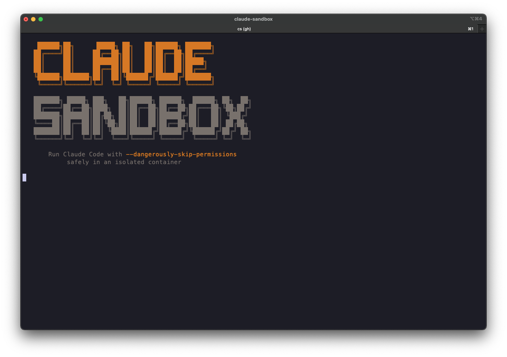

# Claude Sandbox

Run [Claude Code](https://claude.ai/code) and [Codex](https://developers.openai.com/codex/cli) with every approval prompt disabled, inside a container you can throw away.



## Why

`--dangerously-skip-permissions` is the most useful and most alarming flag in Claude Code. An agent that never stops to ask is dramatically more productive, and also one bad command away from your home directory. Claude Sandbox gives the agent a container to be reckless in.

- **No prompts** — agents run fully unattended
- **Disposable** — the container is destroyed on exit
- **Your credentials work** — SSH agent, GitHub CLI, AWS SSO, all forwarded, none copied
- **Local-first** — sandbox any folder on your machine, or clone from GitHub
- **Your checkout stays clean** — `--worktree` gives the agent its own branch and directory

## What this protects against (and what it doesn't)

Be clear-eyed about this, because the distinction matters.

**It protects against accidents.** A wrong `rm -rf`, a migration against the wrong database, a runaway build, an `npm install` of something awful, a dependency that decides to rewrite your dotfiles. The blast radius is a container that ceases to exist when you close the terminal.

**It does not contain a hostile agent.** To be useful, the sandbox forwards real credentials:

| Mounted / forwarded | Why | What an agent could do with it |
|---|---|---|
| SSH agent socket | git push | Sign as you — push to any repo your key can reach |
| `GH_TOKEN` from `gh` | GitHub CLI | Act as you on GitHub, at whatever scope your token has |
| `~/.aws` | AWS SSO | Use any profile with an active session |
| `~/.claude` | settings, skills, plugins | Edit config and hooks that later run on your **host** |
| `--network host` | dev servers "just work" | Reach anything your machine can, including localhost services |

So: **a compromised or prompt-injected agent inside this sandbox is not contained.** If you are running untrusted code or processing untrusted input, this is the wrong tool — use an isolated VM, or Claude Code's [native sandboxing](https://code.claude.com/docs/en/sandboxing) with a network allowlist.

`~/.claude` is mounted whole and read-write on purpose — settings, skills, plugins, session history and `--resume` all need the real thing.

What Claude Sandbox does give you:

- Host **file permissions are never modified**. (An earlier version ran `chmod -R 777` across the workspace, which in local mode propagated straight to your real repository. Fixed, and there's a test.)
- Mounted folders can be made **read-only** with `-m path:ro`.
- With `--worktree`, your working tree is **not mounted at all** — the agent works on a scratch branch in a separate directory.

## Requirements

- **Docker** — [OrbStack](https://orbstack.dev/) (recommended) or Docker Desktop
- **macOS** or **Linux**
- `gh`, `gum`, `jq` — the installer offers to install these
- A Claude Code subscription or API key

## Install

```bash
curl -fsSL https://raw.githubusercontent.com/rsh3khar/claude-sandbox/main/install.sh | bash
```

This installs a pinned release, verifies it against the published `SHA256SUMS`, and pulls the prebuilt multi-arch image from GHCR (falling back to a local build if the registry is unreachable).

```bash
./install.sh --version v0.3.0   # pin a specific release
./install.sh --no-pull          # always build the image locally
./install.sh --link             # dev mode: symlink to a clone
./install.sh --uninstall
```

## Usage

### Local folders

```bash
cs .                      # sandbox the current repo (from any subdirectory)
cs ~/projects/my-app      # any folder — git or not
cs . -w                   # worktree mode: your checkout is never touched
cs . -m ~/work/api -m ~/notes:ro    # mount siblings, some read-only
```

Recent workspaces are remembered along with their mounts, so a multi-repo session is one pick away next time.

A repo that always needs the same companions can say so once. Commit a `.claude-sandbox` file:

```ini
MOUNTS=../api,../web,~/design-docs:ro
WORKTREE=true
BROWSER=true
```

Config files are **parsed, not sourced** — a `.claude-sandbox` in a repo you just cloned cannot run code on your machine.

### GitHub repos

```bash
cs owner/repo
cs owner/repo -b feature/login
cs git@github.com:owner/repo.git
```

### Headless

```bash
cs exec "run the test suite and summarize failures"
cs exec "review the diff on this branch" ~/work/api --agent codex
```

Only the agent's output goes to stdout, so it pipes and scripts cleanly.

### Managing sandboxes

```bash
cs ps          # running sandboxes and their mounts
cs attach      # open a second shell in one
cs orphans     # sandboxes whose terminal is gone
cs kill --all
cs doctor      # check your setup
```

### Inside the sandbox

```bash
c    # claude, permissions off
x    # codex, permissions off
```

## Worktree mode

```bash
cs . --worktree
```

The agent gets a git worktree on a scratch branch. Your working tree is never mounted, so it cannot be dirtied — but commits land in your repo's object store, so on the host:

```bash
git log sandbox/20260726-143022     # review what the agent did
git merge sandbox/20260726-143022   # keep it
```

On exit, an untouched worktree is removed automatically; one with work in it is kept, and the exact review/merge/discard commands are printed.

## Auto-save

Off by default — a commit every 60 seconds buries real history under dozens of `auto-save #N` commits.

```bash
cs . --auto-git --interval 120
```

When enabled it commits only when there are changes, and refuses to commit during a merge, rebase, cherry-pick, or on a detached HEAD.

## What happens to your local folders

They are bind-mounted, which means the agent edits **your real files, live** — that is the point, and it is why changes show up in your editor immediately.

Two consequences worth being clear about:

- **Killing the sandbox loses nothing.** Writes go straight to your disk as they happen; there is no copy to lose. Uncommitted work is still there afterwards.
- **The agent can delete things for real.** `rm` inside the container removes the file from your disk. Committed files come back with `git checkout`; *untracked* files have nothing to come back from.

If you routinely have untracked work you would miss, `--snapshot` records the working tree (including untracked files, excluding gitignored ones) to `refs/claude-sandbox/pre-session/<ts>` before starting. It never touches HEAD, your index, your working tree or your stash, and restore commands are printed on exit:

```bash
cs . --snapshot
# later
git diff --stat <ref>                     # what did this session change?
git checkout <ref> -- path/to/file        # bring one file back
```

Off by default — most sessions do not need it.

## Options

| Flag | Effect |
|---|---|
| `-y, --yes` | No prompts, use defaults |
| `-w, --worktree` | Isolate work in a git worktree |
| `-b, --branch <name>` | Check out or create a branch |
| `-m, --mount <path[:ro]>` | Mount another folder |
| `-n, --name <name>` | Container name |
| `--agent claude\|codex` | Agent for `exec` |
| `--auto-git` / `--interval <s>` | Periodic commits |
| `--browser` | Headless Chromium + Playwright MCP |
| `--update-tools` | Update agent CLIs at startup |
| `--snapshot` | Record the working tree first (see below) |
| `--network <mode>` / `-p a:b` | Networking |
| `--image <ref>` / `--pull` / `--no-pull` | Image selection |
| `--dry-run` | Print the docker command and exit |

Global defaults live in `~/.config/claude-sandbox/config`, using the same keys.

## How it works

```
┌──────────────────────────────────────────────────────────────────┐
│  Host                                                            │
│  ~/.claude   ~/.ssh   ~/.aws   ~/.config/gh   SSH agent          │
│      │                                              │            │
└──────┼──────────────────────────────────────────────┼────────────┘
       │ mount                                       │ forward
       ▼                                             ▼
┌──────────────────────────────────────────────────────────────────┐
│  Container (destroyed on exit)                                   │
│                                                                  │
│  ~/workspace/<repo>/      your folder, or a git worktree of it   │
│  ~/workspace/<other>/     extra mounts, rw or ro                 │
│  claude / codex           permissions disabled                   │
└──────────────────────────────────────────────────────────────────┘
```

Containers are labelled `com.claude-sandbox.managed=true`, which is how `ps`, `attach` and `kill` find them regardless of image tag.

## Development

Everything runs through Docker — no host tooling to install.

```bash
make check        # lint + format check + unit tests
make test         # bats unit tests (no Docker daemon needed)
make build        # build the image
make test-image   # build, then smoke-test the image
make dry-run      # print the docker command for this repo
make dev          # symlink ~/.claude-sandbox to this clone, then build
```

`claude-sandbox` is safe to `source` — `main` only runs when executed — which is how the unit tests exercise its internals.

## Releases

Commits follow [Conventional Commits](https://www.conventionalcommits.org/). [release-please](https://github.com/googleapis/release-please) opens a release PR that maintains `CHANGELOG.md` and the version in `claude-sandbox`; merging it tags the release, publishes a verified tarball, and pushes a multi-arch image to `ghcr.io/rsh3khar/claude-sandbox` with build provenance.

## Troubleshooting

**AWS credentials expired** — refresh on the host with `aws sso login`; `~/.aws` is bind-mounted, so the container picks it up immediately.

**Claude asks for login** — regenerate with `claude setup-token`, then `echo 'TOKEN' > ~/.claude-sandbox-token && chmod 600 ~/.claude-sandbox-token`.

**Port not reachable** — bind to `0.0.0.0`, not `127.0.0.1`. On Docker Desktop, host networking must be enabled in settings; otherwise use `--network bridge -p 3000:3000`. `cs doctor` will tell you which runtime you're on.

**A sandbox outlived its terminal** — `cs orphans`, then `cs kill <name>`.

## Screenshots

Clipboard doesn't cross the container boundary. Point macOS screenshots at a shared folder (the installer offers to do this):

```bash
mkdir -p ~/.claude/screenshots
defaults write com.apple.screencapture location ~/.claude/screenshots
killall SystemUIServer
```

Then take a screenshot and say "check the screenshot".

## License

MIT.
